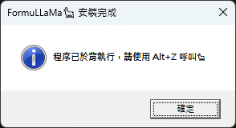
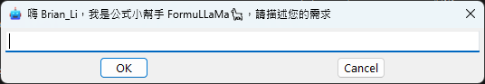
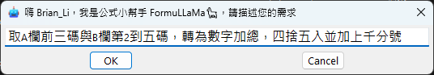
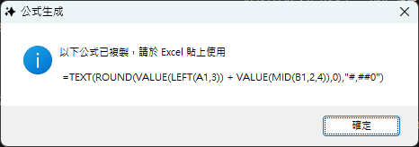
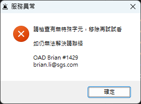
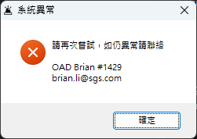

 
 


# ⌨️demoAHK

- 此專案為 [AutoHotKey](https://www.autohotkey.com/) 開發使用，也進行測試與部署作業
- AutoHotkey 是一種開源的自動化腳本語言，主要用於 Windows 系統。主要功能包括鍵盤和滑鼠控制、創建快捷鍵以及自動化任務執行

## 📂專案架構

```c
📁 asset    //圖檔、圖示
📁 demo     //測試腳本、各種範例實作 *.ahk
📁 install  //安裝或反安裝指令集 *.bat
📁 pub      //腳本編譯檔 *.exe
📁 src      //腳本開發檔 *.ahk
```

## 📜Scripts (腳本)

- AutoHotKey 撰寫的腳本(Scripts)，副檔名為 `ahk`
- `ahk` 腳本需安裝 AutoHotKey 主程式才可執行
- 主程式有兩個版本，需對應腳本語言 (語法好像有差異)
- 以下是一個簡單例子，安裝主程式後，點兩下 `ahk` 即可使用快捷鍵

```ahk
;使用 Ctl+J 啟動小算盤
^j::
Run calc
Return
```

>💡開發建議先安裝 `v2.x` 版本，並選擇安裝到 `Users` 之下，減少權限問題。若執行到 `v1.x` 版版本語法，會提示是否下載，當下在進行安裝即可

## 📦EXE (可執行檔)

- `ahk` 可透過主程式編譯為 `exe`
- 解決一般使用者安裝主程式問題，`exe` 雙擊即可直接使用
- 可將 `exe` 之捷徑 `lnk` 放入啟動資料夾，開機便可直接啟動
- 安裝(複製 `exe` )與建立捷徑等，可使用指令集簡化操作，例如 `bat`

>💡啟動資料夾可透過 `Win+R` 輸入 `shell:startup` 開啟並取得路徑<br>
⚠️`bat` 可能有執行權限問題，需額外注意


# 🦙FormuLLaMa - 你的公式小幫手

- 第一個 AutoHotKey 試作品，封裝為 `exe` 可直接使用
- 透過自然語言提問 Excel 公式需求，由 AI 理解後生成回覆
- 生成內容會直接複製到剪貼簿，於 Excel 貼上即可使用

>💡命名參考英文單字公式 `Formula` 與 Meta 開源模型 `LLaMa` 而來，傳達了該服務主要處理能力(生成公式)並與大語言模型(AI)相關

## 📱安裝程式

- 開啟路徑 `\\twfs007\SGSSHARE\OAD\Brian\_Publish\ahk\`
- 可先檢視其中 `示範影片.mp4` 確認功能符合需求
- 點選其中 `install.bat` 進行安裝，成功會顯示以下畫面



>💡反安裝請執行路徑下 `uninstall.bat` 即可<br>
🚨如擔心開放環境 `bat` 指令集遭竄改，也可下載本 repo 內檔案執行

## 🎮使用 FormuLLaMa

### 呼叫小幫手

- 假設程式已於背景執行，按下快捷鍵 `Alt+Z` 應會看到以下畫面
- 程式會判斷登入使用者，並自我介紹祂是 Excel 公式小幫手 :D
- 游標會停在中間文字框，也是您稍後要輸入需求的地方



>💡取消執行可按畫面 `Cancel` 或 `Esc` 離開

### 輸入您的需求

- 接下來請在文字框輸入您對公式的需求，可用自然語言描述即可
- 輸入完畢按 `Enter` 或 `OK` 送出，稍等一下即可得到回應
- 可輸入實際資料供其參考，但請避免使用雙引號 `"`



>⚠️內容請以公式相關為主，避免 AI 出現幻覺最終瞎掰一通

### 取得結果

- 看到以下畫面表示公式已經生成，並複製到剪貼簿
- 再來請於 Excel 需要使用之處貼上 `Ctrl+V` 即可



>🚨AI回應可能因提問而有差異(小幫手可能幫倒忙)，公式務必再進行測試驗證

### 異常處理

- 如果執行異常，您可能會看到



- 如果服務中斷，您可能會看到



- 如連續發生異常，可連絡 OAD 相關人員進行確認
- FormuLLaMa 會留存異常紀錄 `log`，請再提供做為參考資料